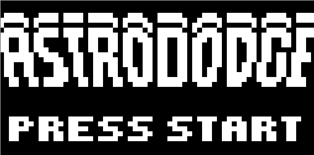

# Chip-8 Emulator
A simple chip-8 emulator written in C++



# Requirements
- SDL2 - should be installed on your systems
- ImGui
- p-ranav/argparse

ImGui and argparse are added as git submodules in extern

# Building
Remember to clone repository with submodules:\
`git clone --recurse-submodules https://github.com/janBorowy/Chip8`
1. Install dependencies, for example with pacman:\
`sudo pacman -S sdl2`
2. Build using cmake:
```
mkdir build
cd build
cmake ..
cmake --build .
```
# Usage
To run a rom `example.ch8`:
`./chip8-emulator example.ch8`
To run a rom `schip-example.ch8` with SUPER-CHIP 1.0 compatibility mode:
`./chip8-emulator -c schip schip-example.ch8`

# Compatibility modes
Different chip8 interpreter implementations have often subtle differences
in how they handle some instructions, which results in ambiguity.
These differences are called quirks and they are often the source
of why some rom works on one interpreter but completely fails on the other.
Emulator's compatibility mode chooses right interpretation of instructions
for interpreter it's compatible with.

Available compatibility modes:\
format: (argument) - (compatible interpreter)\
default - COSMAC VIP\
schip - SUPER-CHIP 1.0
# Sources
- Main guide and inspiration - https://tobiasvl.github.io/blog/write-a-chip-8-emulator/
- Source of information about quirks - https://chip-8.github.io/extensions/\ 
